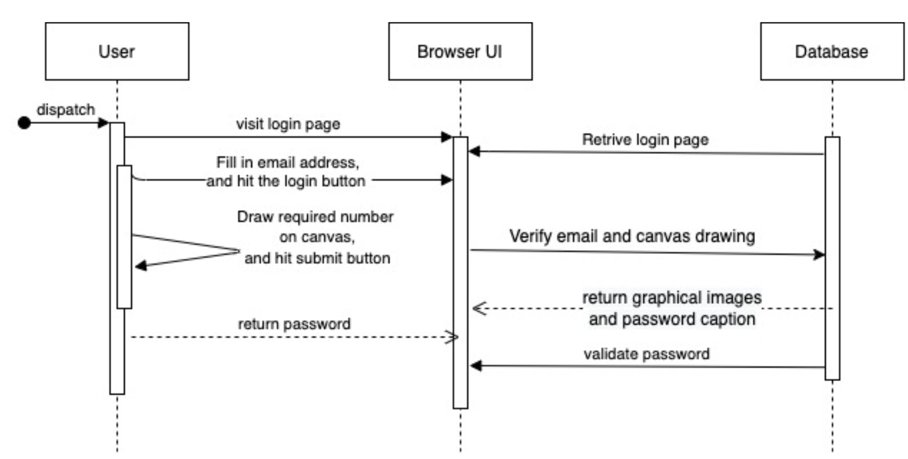
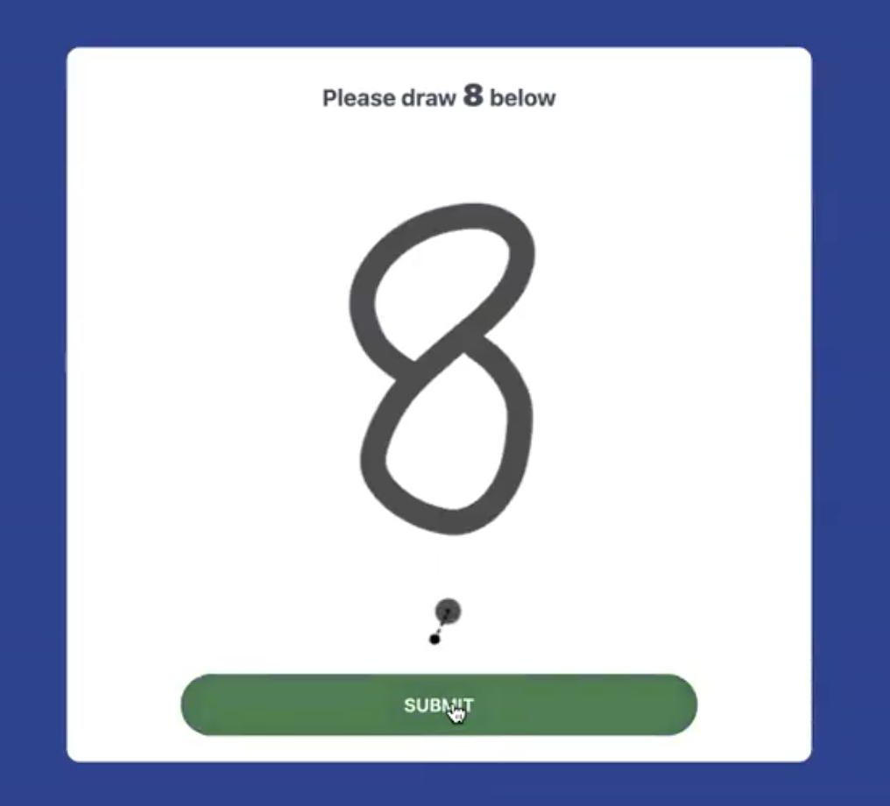
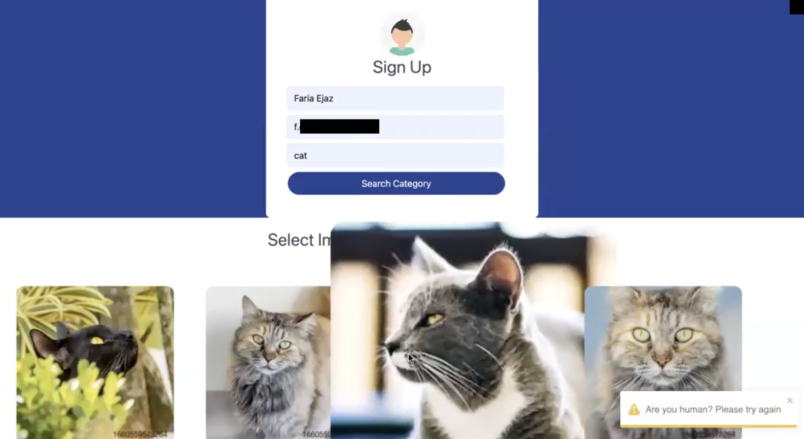
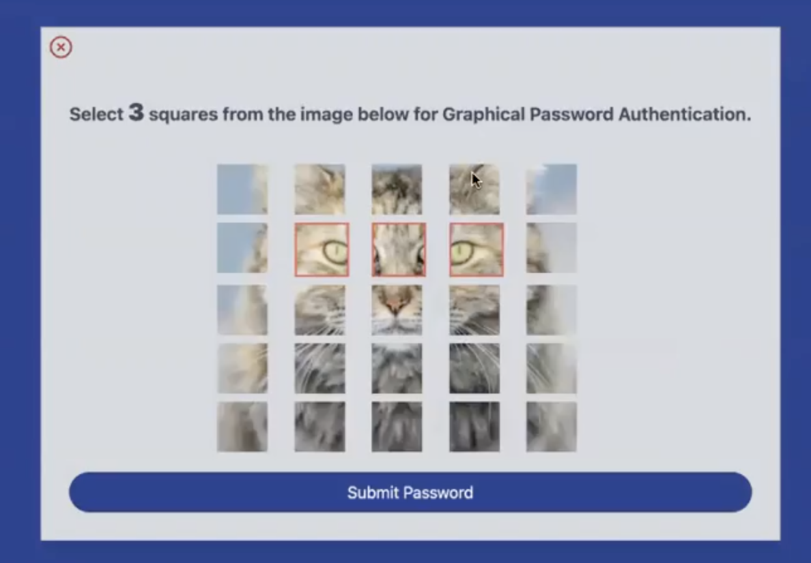

# Graphical Password Authentication System 🔐

<p align="center">
  
</p>

An innovative authentication system using image patterns instead of traditional text passwords. Built with modern web technologies for enhanced security and usability.

## Abstract 📝  
Traditional passwords are vulnerable to guessing and shoulder surfing. This system enhances security with graphical authentication, allowing users to:  
- Select images from a grid  
- Arrange tiles in a sequence  
- Authenticate via visual patterns  

### Key Advantages:  
🛡️ Secure against brute-force attacks  
🎯 Intuitive interface  
👁️🗨️ Resistant to shoulder surfing  
💡 Lower cognitive load  

## Features ✨  
- Graphical password authentication  
- Canvas-based CAPTCHA  
- Multi-step authentication  
- Secure MongoDB storage  
- Three-tier architecture (Client-Server-Flask)  


## Installation 💻

```bash
# Clone repository
git clone https://github.com/your-username/graphical-password-auth.git

# Client setup
cd client
yarn install

# Server setup
cd ../server
yarn install

# Flask setup
cd ../flaskServer
pip3 install -r requirements.txt
python3 -m spacy download en_core_web_sm
```

## Configuration ⚙️

### server/.env
```env
UNSPLASH_ACCESS_KEY=
MONGODB_URL=your_mongodb_atlas_url
PORT=4000
NUM_OF_IMAGES_IN_SET=9
TOTAL_NUM_OF_ITERATIONS=4
```

### client/.env
```env
REACT_APP_UNSPLASH_ACCESS_KEY=
REACT_APP_TOTAL_TILES_COUNT=3
REACT_APP_TOTAL_ITERATION_COUNT=1
REACT_APP_PORT=3000
```

## Usage 🚀
Start all services in separate terminals:

```bash
# Backend Server
cd server && yarn start

# Frontend Client
cd client && yarn start

# Flask Server
cd flaskServer && python3 server.py
```

Access the application at [http://localhost:3000](http://localhost:3000)

## System Workflow 📊

### Registration/Login Sequence 
  
  

### Authentication Process
#### Main Screen
  

#### CAPTCHA Verification
  

#### Image Selection
  

#### Tile Pattern Setup
  

## Tech Stack 🛠️

### Frontend


### Backend


### Database


### Tools


